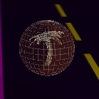

# MANUAL DE JUEGO: Neo-Tokyo Riders

## 1. Introducción

> Neo-Tokyo, Año 20XX. Una ciudad de asfalto y luces de neón, en la que tus propios pensamientos pueden ser ensordecidos por el ruido de sus gentes. Una noche más, enciendes tu moto y comienzas a acelerar buscando huir de tus problemas. Ve con cuidado, en Neo-Tokyo solo sobreviven aquellos que saben manejarse por las calles.

Neo-Tokyo Riders es un juego arcade basado en juegos del género Infinite Runner, con gráficos altamente inspirados en la estética Synthwave y en la estetica de los años 80. Este juego ha sido realizado usando la biblioteca **Three.js** de Javascript, en combinación con el canvas proporcionado por **HTML5** y **CSS**.

## 2. Objetivo del juego

El juego ofrece 3 niveles de dificultad incremental, además de un tutorial que explica los fundamentos del juego. El jugador controla una moto que se mueve de izquierda a derecha usando las flechas direccionales del teclado, y el objetivo es esquivar los obstáculos con forma de cajas rojas semitransparentes que se encuentran en la carretera. 

La moto cuenta con 3 vidas que se encuentran en la esquina superior izquierda, indicadas por el siguiente icono: . Colisionar con un obstáculo implica perder una vida, adicionalmente después de
un impacto el jugador se volverá invulnerable durante 3 segundos y no podrá perder más vidas hasta que pase este tiempo. Para indicar esta invulnerabilidad, la moto se verá translucida durante el periodo de estos 3 segundos. 

El jugador también podrá recoger un power-up, esferas de vida extra. Si el jugador atraviesa una de estas esferas se re-establecerá una vida, adicionalmente se podrá superar el limite de 3 vidas y conseguir hasta un máximo de 5 vidas.

Si el jugador pierde todas las vidas se terminará el juego. El objetivo es alcanzar la meta al final del nivel antes de que esto pase. 

## 3. Objetos del mapa

Se encotnrarán los siguientes objetos esparcidos a través del mapa:

| **Obstáculo**: Rectangulos rojos semitransparentes que aparecen por el mapa, colisionar con ellos implica perder una vida. |  |
| ------------------------------------------------------------ | -------------------------- |
| **Esfera de vida extra**: Esfera semitransparente con una palmera en el interior, colisionar con una te permite obtener una vida |  |

## 4. Controles

- **Flecha direccional izquierda:** Permite mover la moto a la izquierda.
- **Flecha direccional derecha:** Permite mover la moto a la derecha.
- **Barra espaciadora:** Se utiliza para avanzar por algunos menús como el menú de Victoria o el de Derrota
- **Tecla [R]:** Permite activar y desactivar el Modo Retro (más información más adelante)

## 5. Modo Retro

Para acompañar a la estética retro del juego, se ha hecho uso de un objecto **EffectComposer** para aplicar un filtro postprocessing que pixela la escena, el cual se ha denominado **Modo Retro**. Este filtro puede ser activado o desactivado en cualqueir momento pulsando la **Tecla [R]**.

## 6. Capturas de pantalla del juego

